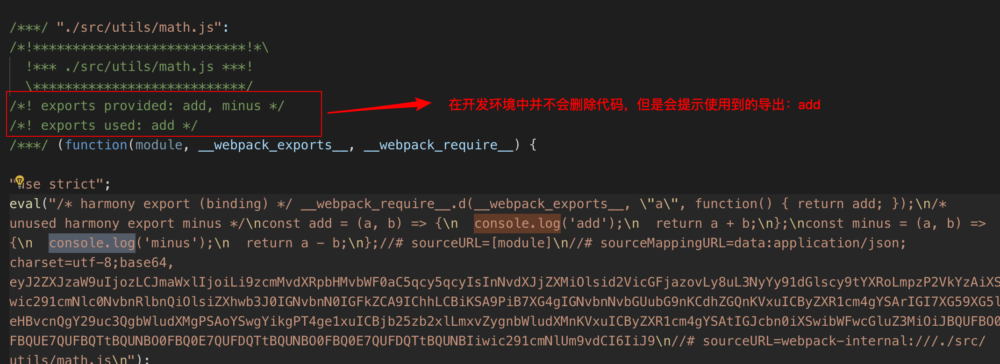

## `Webpack`到底是什么？
首先我们看一下维基百科的定义：  
> `Webpack`是一个开源的前端打包工具。`Webpack`提供了前端开发缺乏的模块化开发方式，将各种资源视为模块，并从它生成优化过的代码。`Webpack`可以从终端、或是更改`webpack.config.js`来设置各项功能。要使用`Webpack`前须安装`Node.js`。`Webpack`其中一个特性是使用加载器来将资源转换成模块。开发者可自定义加载器的顺序、格式来因应项目的需求

接下来我们再看一下官网的定义：  
> A bundler for javascript and friends. Packs many modules into a few bundled assets. Code Splitting allows for loading parts of the application on demand. Through "loaders", modules can be CommonJs, AMD, ES6 modules, CSS, Images, JSON, Coffeescript, LESS, ... and your custom stuff.

用我比较拙劣的英文水平翻译成中文大概是这样： 
> 一个`javascript`和相关生态环境的打包工具。分析代码结构，将模块打包成有相互依赖关系的资源。`Webpack`可以通过代码分割来按需加载你的应用，也可以通过加载器(`loader`)使CommonJs, AMD, ES6 模块化, CSS, Image, JSON, Coffeescript, LESS以及你自定义的一些东西可以在浏览器直接运行。

通过`webpack`官网和维基百科中的相关介绍的学习，这里我们整理一下个人对`webpack`的理解：  
* `Webpack`是一个前端打包工具，帮助我们处理各种相关的模块资源，生成浏览器中可以直接运行的静态文件
* 将前端从通过`script`标签引入代码带领到了模块化编写代码的时代，前端可以直接使用`ES6 modules`、`CommonJs`等模块化规范语法进行代码编写
* 可以通过`loader`将浏览器不能直接运行的语言如`SCSS`、`TypeScript`能够直接在浏览器中运行，丰富了前端开发过程中使用的到技术栈，也能让开发者享受到各种语言工具带来的红利。
* `Webpack`通过代码分割实现了应用的按需加载，极大的提升了应用性能和用户体验

在初步了解了`webpack`的定义之后，我们从以下几点来学习`webpack`的相关内容：  
* [`webpack`核心概念](./webpack-demo1/readme.md)
* [`webpack`高级概念]()
* [`webpack`配置案例]()

在学习之后我们的最终目的是自己从0开始使用`webpack`搭建一个前端项目，支持`TypeScript`+`React`+`SASS`技术栈。

## 关键点记录
在开发环境配置`Tree Shaking`,代码并没有删除，但是相应的使用到的导出会在注释中提示并应用到程序中:  
