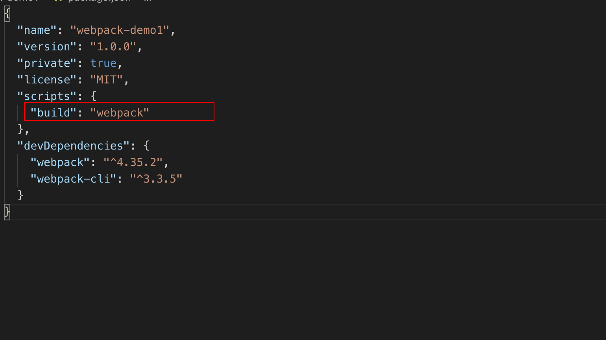

## 安装
在使用`webpack`之前我们要安装`webpack`,安装命令如下：  
```npm
# 创建webpack-demo文件夹
mkdir webpack-demo
# 生成package.json文件，对项目依赖进行管理
yarn init -y
# 安装webpack相关依赖
yarn add webpack webpack-cli -D
```
这里我们安装`webpack-cli`的原因是因为它可以让我们可以在命令行中运行`webpack`,否则`webpack`命令将无法运行

## 生成打包文件
接下来我们建立`src`目录来管理我们的源代码，并建立`main.js`文件，写入第一行代码：  
```js
console.log('Hello webpack!')
```

接下来我们在项目根目录建立`webpack`的配置文件`webpack.config.js`并进行最简单的配置：  
```js
const path = require('path');
module.exports = {
  mode: 'development',
  entry: {
    main: './src/main.js'
  },
  output: {
    path: path.resolve(__dirname, './dist'),
    filename: 'main.js'
  }
}
```

之后我们通过`package.json`文件中的`script`命令来为`webpack`添加快捷命令:  


配置好后通过命令行执行：`yarn build`，会发现根目录出现了`dist`目录，里边有我们的代码`main.js`。

接下来我们在根目录新建`index.html`，通过`script`标签将打包后的代码引入并在浏览器中打开：  


或者可以通过`node`命令来运行打包文件：  


到这里我们成功打包好了我们的第一个文件，感觉还是有些小激动的。

## 入口和出口
在配置之前，我们先简单理解下入口和出口的概念：
* 入口(`entry`): 整个项目的起始模块，用来作为构建其内部依赖图的开始
* 出口(`output`): 告诉`webpack`打包后的文件所存放的目录

这里是一个打包截图：  


了解了基本概念之后，我们来看一下常用的相关配置：  
```js
entry: {
  main: './src/main.js' // 入口文件对应的源代码位置，key值为打包生成后的chunkNames
},
output: {
  path: path.resolve(__dirname, './dist'), // 打包生成文件存放的位置
  // 使用每次构建过程中，唯一的hash生成
  filename: '[name]_[hash].js', // 每个打包输出文件的名称
  // publicPath: 'https://cdn.example.com/assets/', // 会在引入的资源前加入该路径，例：将资源托管到cnd
}
```
在配置文件中我们使用了`[name]`这种符号，这是`webpack`中的占位符(`placeholder`)，这里介绍下配置中使用到的，如果小伙伴们感兴趣可以自己查阅官方文档：  
* `[name]`: 模块名称
* `[hash]`: 模块标识符的`hash`(每次打包都会生成对应唯一的`hash`值)

## 打包模式
在`webpack`中，我们可以通过`mode`选项，来分别为生成环境打包和开发环境打包使用相应的内置优化：  
```js
mode: 'development' 
```
目前我们的配置是开发环境: `development`,当我们使用`production`的时候，`webpack`会将我`node`中的全局变量改为： `process.env.NODE_ENV`的值设置为`production`,并且也会启用代码压缩等功能，有助于帮我们减少代码体积，提升用户体验。

而当我们使用`development`模式时，`webpack`会将`process.env.NODE_ENV`的值设置为`development`,并取消代码压缩等功能，提升开发体验

## 使用插件